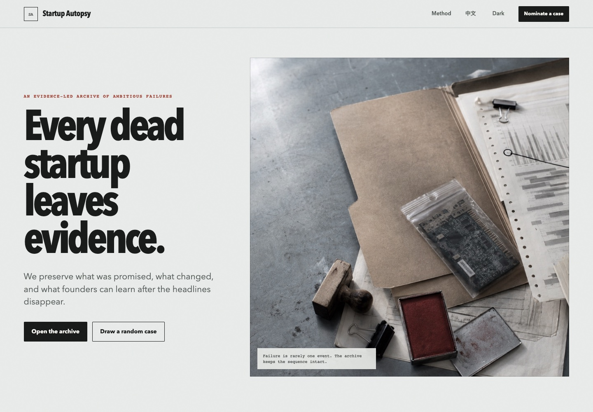

# Startup Autopsy

Startup Autopsy is an evidence-led archive of ambitious technology companies that shut down, sold off, or collapsed.

Instead of reducing failure to a single cause, each case file reconstructs the sequence of funding, product shifts, layoffs, strategic changes, and shutdown events. Verified facts are labeled separately from editorial inference.



## What is included

- Four bilingual case files: Argo AI, Olive AI, Babylon Health, and Zume.
- Search and sector filters.
- Expandable case files with timelines, findings, lessons, and source links.
- English and Simplified Chinese interface.
- Light and dark themes.
- Shareable deep links such as `#case=argo-ai`.
- A local prototype flow for nominating future cases.

## Run locally

No build system or package installation is required.

```bash
python3 -m http.server 8080 --directory startup-autopsy
```

Then open `http://localhost:8080`.

## Editorial standard

1. Prefer primary sources such as regulatory filings and company statements.
2. Use contemporaneous reporting to reconstruct what was known at the time.
3. Separate verified facts from disputed claims and editorial inference.
4. Describe failure mechanisms without treating them as a definitive verdict.
5. Accept corrections when stronger evidence becomes available.

## Data structure

Cases live in `data/cases.js`. Each case contains shared metadata plus complete English and Chinese versions of:

- Summary
- Editorial diagnosis
- Timeline
- Findings
- Surviving lesson
- Sources

## Image asset

`assets/autopsy-desk.jpg` was generated for this project with OpenAI's built-in image generation tool. It contains no company logos or readable case text.

## Next milestones

- Move case data to portable JSON.
- Add source snapshots and link-health checks.
- Add a public contribution workflow through GitHub Issues.
- Add corrections and evidence-confidence history.
- Publish the archive with GitHub Pages.

## License

Code is available under the MIT License. Case summaries are original editorial work; linked source material remains the property of its respective publishers.
